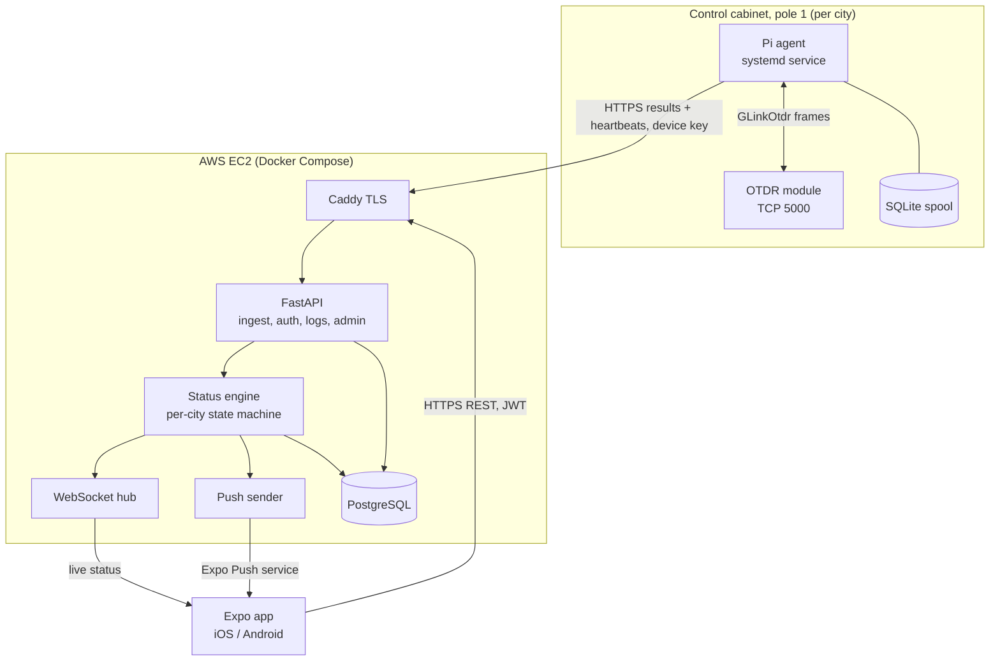
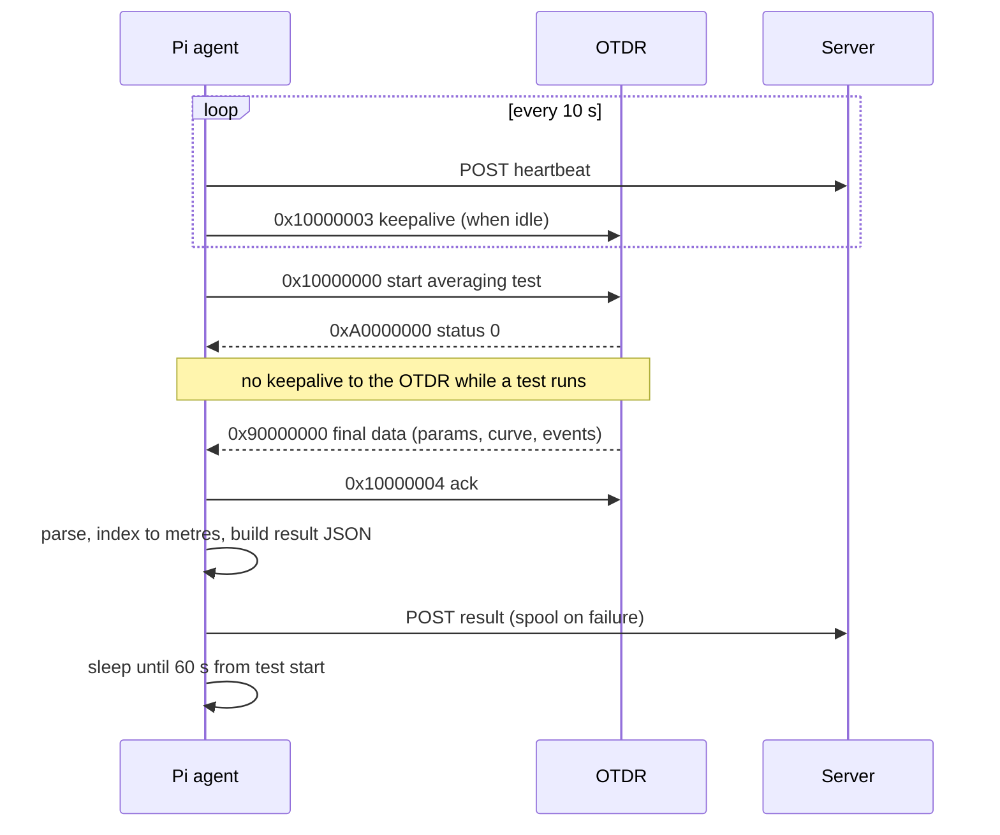
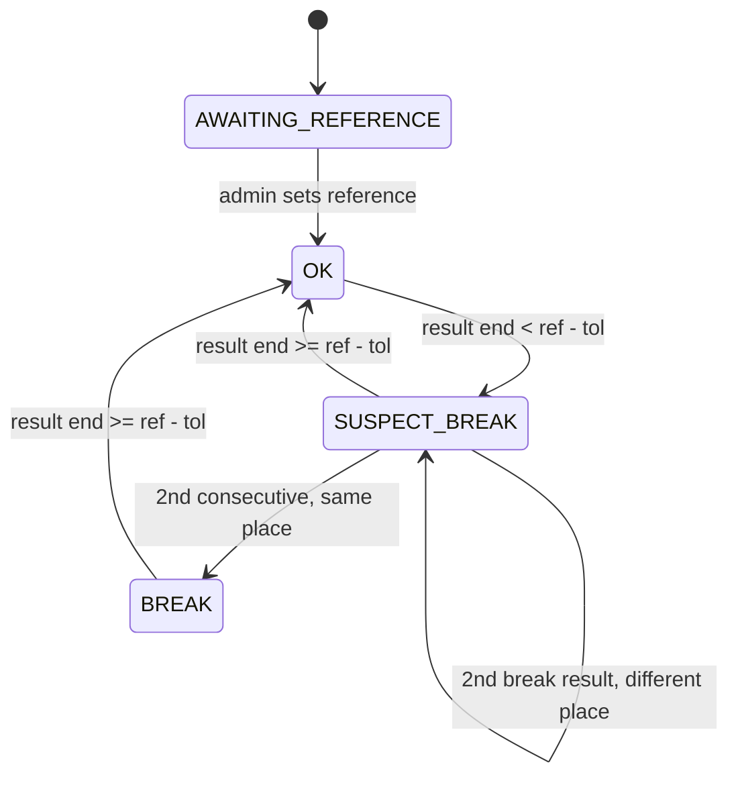
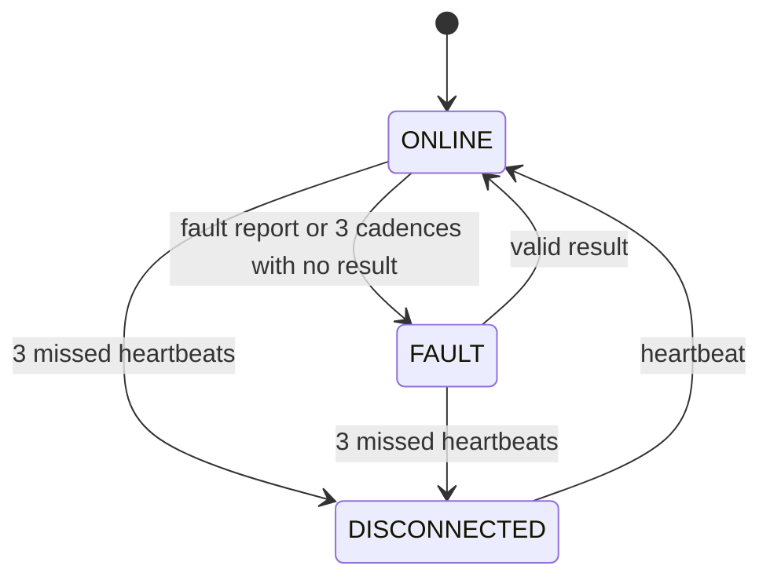

# Eruv Fiber Monitoring System - Plan

---

## Goal Capsule

- **Objective:** Eruv maintainers in each city learn within minutes that their eruv line is broken, see on a map between which two poles the break is, and can navigate there. They can also tell at a glance whether the line is intact, when it was last checked, and whether the monitoring equipment is offline.
- **Means:** A Raspberry Pi 5 per city drives an OTDR module over its Ethernet protocol and reports results to one AWS server. The server decides the status of each city and maps a break distance onto the pole ring. An Expo / React Native app shows the status on an OpenStreetMap map and receives push alerts (KTD1, KTD2, KTD4).
- **Product authority:** The Product Contract below. The key decisions it records were settled with the user in this session and must not be reopened during implementation.
- **Execution profile:** Greenfield. There are three independent deliverables in one repository: `pi-agent/`, `server/`, `app/`. They share a written contract under `contracts/`.
- **Stop conditions:** Stop and ask if implementation shows that the OTDR does not report a break as an early end event, if the production server has no HTTPS domain before the iOS release build, or if a settled decision below turns out to be infeasible.
- **Who finishes:** Claude Code in VS Code, working unit by unit. The user supplies the AWS address, the pole coordinates, and access to the real hardware for the smoke tests.

---

## Product Contract

### Summary

The system has three parts:

- **Raspberry Pi agent (Python).** One per city. It runs an OTDR averaging test every 60 seconds and reports the parsed result and a heartbeat to the server. It restarts itself after power loss.
- **Server.** It stores each city's poles and logs. It detects breaks against a reference test and marks a Pi as disconnected only after several missed heartbeats. It places each break between two poles.
- **App (Expo, iOS and Android).** It is distributed privately to approved maintainers and admins. It shows each city's pole polygon, a red X at the break, a green, red or orange status banner with the time of the last check, a Waze link, and push alerts. Admin screens handle users, cities, poles, and the reference test.

### Problem Frame

A city-wide eruv, about 45 km in Be'er Sheva, is only valid while the line is continuous. Today nobody knows the line is cut until someone physically sees it.

An optical fiber runs along the eruv line. A cut fiber means a cut eruv, so an OTDR at pole 1 can detect a cut and measure its distance.

The hardware exists: a Pi 5, an OTDR module, and a 1 km launch box in the control cabinet on pole 1. What is missing is the software chain from the OTDR to a maintainer's phone. It must also serve more cities later, each with its own set of equipment.

### Actors

- A1. **Maintainer.** Responsible for one city's eruv. Registers in the app, waits for admin approval, receives alerts and views that city only.
- A2. **Admin.** Approves users. Manages cities, poles, devices and the reference test. Can view all cities.
- A3. **Pi agent.** One per city, in the pole-1 cabinet. Drives the OTDR and reports to the server.
- A4. **OTDR module.** Controlled by A3 over TCP (`GLinkOtdr` protocol).

### Key Decisions

- **Break location uses pure geographic distance between pole coordinates.** No fiber-slack correction is applied. Governs R12. (session-settled: user-directed — chosen over automatic calibration from the measured total fiber length: the fiber is taut between poles and the user wants the simple geographic model. Residual risk is recorded under Risks.)
- **No special Shabbat or holiday behavior.** The system runs and alerts identically at all times. (session-settled: user-directed — chosen over a pre-Shabbat status push and a motzei-Shabbat summary: halachic handling stays with the team, outside the app.)
- **A break is confirmed by 2 consecutive tests.** Governs R10. (session-settled: user-directed — chosen over alerting on a single test: filters one-off abnormal measurements at the cost of one extra cadence (about 60 s) of latency.)
- **Test cadence is one OTDR test every 60 seconds, with a 30-second averaging measurement.** Governs R2. (session-settled: user-directed — originally 90 s; on 2026-10-01 the user shortened it to 60 s for a faster break alert while keeping the 30 s measurement for reliability, chosen over a 90 s cadence and over shortening the measurement time.)
- **Only maintainers and admins use the app.** Access is by registration plus admin approval, and the app is distributed privately. Governs R19, R20, R21. (session-settled: user-directed — chosen over public access and over open registration: break locations and pole data are not public.)
- **Admin functions live inside the same app, on admin-only screens.** Governs R24–R27. (session-settled: user-directed — chosen over a separate web admin panel and over server-only scripts.)
- **The map is OpenStreetMap.** Governs R15. The user stated this requirement.
- **Expo + React Native for the app.** Governs R18. (session-settled: user-approved — the user proposed it; it was confirmed over Flutter, which offers no advantage here, and over a PWA, whose background push on iOS is weak.)
- **Alerts fire on recovery too, and an unresponsive OTDR is its own orange status.** Governs R11, R13, R22. Proposed in the scope summary and accepted with it.
- **Access to a city always passes through admin approval, including a later city change.** Governs R20, R22. It follows from the settled restricted-access decision: a self-service city switch would expose another city's poles and breaks without approval.
- **iOS production distribution is an Apple Business Manager custom app.** Governs R21. (session-settled: user-directed — chosen over TestFlight with a rebuild every 60 days: builds do not expire, so alerting never lapses silently.)
- **The green banner reads "העירוב תקין" (Eruv intact).** Governs R16. (session-settled: user-directed — chosen over "No break detected": the user wants the plain wording; the system still detects fiber cuts only.)
- **Login uses email and password.** Governs R19. It is the least operational setup: no SMS provider, and it works on both platforms.

### Requirements

**Pi agent**

- R1. The agent connects to the OTDR over TCP (default `192.168.1.249:5000`) and runs manual-mode averaging tests on single-mode fiber. The wavelength, range, pulse width, measurement time and group refractive index come from the device's config file.
- R2. The agent starts a new test every 60 seconds, measured from the start of the previous test, and runs continuously.
- R3. After each test the agent sends the server one result message containing everything in R4.
- R4. A result message carries:
  - city and device identity, sequence number and UTC timestamp
  - the test parameters actually used
  - fiber length, link loss and every event point, each with its distance in metres
  - the end-event distance
  - the OTDR firmware version, agent version and basic Pi health (uptime, CPU temperature, free disk)
- R5. The agent sends a heartbeat to the server every 10 seconds, independent of the tests.
- R6. The agent keeps the OTDR's TCP session alive, so the module's 1-minute idle reset never triggers.
- R7. When the OTDR does not answer, rejects a command, or the socket fails, the agent reports an equipment-fault message to the server and reconnects with backoff.
- R8. The agent starts on boot and restarts itself after any crash or power loss, with no manual step.
- R9. When the server is unreachable, the agent keeps the most recent results locally and delivers them in order once the connection returns.

**Status and break detection (server)**

- R10. A city is in `BREAK` when two consecutive results show an end event earlier than the city's reference fiber length by more than the break tolerance (default 50 m). The two break distances must agree within the same tolerance.
- R11. A city returns to `OK` on the first result whose end event is at or beyond the reference minus the tolerance. The transition is logged and alerted. An end event more than the tolerance past the reference (for example after a repair added a spliced section) counts as intact and logs a "fiber longer than reference — re-baseline" warning for admins.
- R12. The break point is computed as follows:
  - Subtract the launch-box offset (default 1000 m, set per city) from the OTDR break distance.
  - Walk the ordered pole ring from pole 1 by great-circle distance.
  - Report the two poles that bound the break and an interpolated coordinate between them.
- R13. A device is `DISCONNECTED` after 3 consecutive missed heartbeats (30 s by default). It is `FAULT` when heartbeats arrive but either an equipment-fault message was reported or no test result arrived for 3 cadence periods. Device health is tracked separately from the line's break state, so both can be shown at once.
- R14. Until a reference test has been set for a city, that city shows `AWAITING_REFERENCE` and sends no break alerts.

**App: status display**

- R15. The city screen shows an OpenStreetMap map with the pole ring drawn as a closed polygon. Each pole is a marker labelled with its number.
- R16. A top banner shows the city status:
  - green "Eruv intact"
  - red "Break between pole X and pole Y"
  - orange "Monitoring disconnected" or "Equipment fault"
  - neutral "Awaiting reference"
  
  Each state shows the time of the last completed check. When a break is active and the device also goes offline, red stays primary and an orange secondary line is added.

  When the app cannot reach the server, or the last completed check is older than 3 cadence periods (3 min), the banner turns orange "No contact with monitoring server". The last known state is shown as a secondary line. This covers a server outage, which the server itself cannot report.
- R17. When a city is in `BREAK`, the map centres and zooms on the break and shows a red X at the computed break point between the two bounding poles. The two bounding poles are highlighted. The screen also shows a link that opens Waze navigation to that coordinate, with a Google Maps link as fallback. An info button explains that a second break further along cannot be seen until this one is fixed.
- R18. The app runs on iOS and Android from one Expo codebase. The UI is in Hebrew with right-to-left layout.

**App: access and alerts**

- R19. On first launch, a new user registers with name, phone, email and a password, and picks one city from the list of cities. Login is by email and password.
- R20. A registered user sees only a "pending approval" screen until an admin approves them. The screen checks for approval by itself and has a "check again" button. A rejected or disabled user loses access immediately, including open sessions, and sees a screen telling them to contact the admin.
- R21. The app is installable only by invitation. On iOS the production channel is an Apple Business Manager custom app, and TestFlight is used only for pre-release testing. On Android it is a closed Play track or a direct APK.
- R22. An approved maintainer receives a push notification on every live status transition of their city: into or out of `BREAK`, `DISCONNECTED` and `FAULT`. Transitions replayed from a Pi's backlog after an outage are logged but not pushed individually; one push reports the current state if it changed. The user can ask to change city in settings, which sends them back to admin approval for the new city. If notification permission is off or no push token is registered, the app shows a persistent warning with a button to the phone's settings.
- R23. A logs screen lists every status transition and every result summary for the city, newest first. It opens on status transitions from the last 7 days and can be filtered by date range and by event type.

**App: admin**

- R24. An admin sees a queue of pending registrations and can approve, reject, disable, or promote a user to admin.
- R25. An admin can create a city and its device. The admin receives a device API key once, to install on that city's Pi, and can rotate it; rotation invalidates the old key immediately.
- R26. An admin can import a city's poles from CSV (`pole_number,lat,lon`) or KML. The admin sees them on the map as a preview before saving. Pole numbers must be unique and consecutive from 1.
- R27. An admin can set a city's reference from the latest intact result. Setting a reference is refused while the city is in a suspected or confirmed break. When the resulting fiber length is shorter than the pole-ring perimeter by more than 5%, the admin must confirm explicitly. The admin can also edit the city's launch-box offset and break tolerance.

### Acceptance Examples

- AE1. **Covers R10.**
  - **Given:** Be'er Sheva has a reference fiber length of 47,210 m and a tolerance of 50 m.
  - **When:** two consecutive results report end events at 13,400 m and 13,420 m.
  - **Then:** the status becomes `BREAK` after the second result, and an alert is sent once.
- AE2. **Covers R10.**
  - **Given:** the same city.
  - **When:** one result reports 13,400 m and the next reports 47,205 m.
  - **Then:** no break is declared, and the first result is logged as a single abnormal reading.
- AE3. **Covers R12.**
  - **Given:** a break end event at 13,400 m and a 1000 m launch-box offset.
  - **When:** the cumulative ring distance crosses 12,400 m between pole 57 (12,380 m) and pole 58 (12,455 m).
  - **Then:** the banner reads "Break between pole 57 and pole 58", and the X sits 20 m past pole 57 along the segment.
- AE4. **Covers R12.**
  - **Given:** a break distance smaller than the launch-box offset.
  - **Then:** the break is reported as "at the control cabinet / launch box", with pole 1 as the location.
- AE5. **Covers R12.**
  - **Given:** a geographic distance longer than the ring perimeter.
  - **Then:** the X is placed on the last segment (last pole to pole 1), and the log marks the location "beyond mapped ring".
- AE6. **Covers R13.**
  - **Given:** a heartbeat interval of 10 s.
  - **When:** heartbeats stop.
  - **Then:** the city shows orange `DISCONNECTED` 30 s after the last heartbeat, not earlier. A single late heartbeat does not change the status.
- AE7. **Covers R16.**
  - **Given:** a city in `BREAK`.
  - **When:** its device then disconnects.
  - **Then:** the banner stays red with the break location and adds an orange line "Monitoring disconnected since HH:MM".
- AE8. **Covers R14.**
  - **Given:** a newly created city with poles but no reference.
  - **Then:** results are logged, the banner is neutral "Awaiting reference", and no break alert is sent.

- AE9. **Covers R9, R22.**
  - **Given:** the Pi lost its uplink for 2 hours, and during that time the line broke and was repaired.
  - **When:** the uplink returns and the spool drains.
  - **Then:** the log shows the break and the repair as replayed events. No maintainer gets a "Break" push for the old break, and the city ends in `OK`.
- AE10. **Covers R27.**
  - **Given:** a city in `BREAK`.
  - **When:** an admin presses "set reference".
  - **Then:** the request is refused with an explanation, and the reference is unchanged.

### Success Criteria

- A fiber cut is reported to approved maintainers' phones within 4 minutes in the typical case: two test cycles plus delivery. A cut that lands in the middle of a 30 s measurement can cost one more cycle, so the worst case is about 5.5 minutes.
- In the Be'er Sheva field mapping check, each known-location feature on the live eruv fiber maps between the correct pole pair (see the Verification Contract). If it does not, that is the trigger to revisit the geographic-distance decision.
- The Pi recovers unattended from a power cut: results resume within 3 minutes of power returning.

### Scope Boundaries

**Deferred for later**

- Automatic fiber-length calibration or per-pole fiber offsets. The raw measured fiber length is stored anyway (R4), so this can be added without changing the data model.
- A pre-Shabbat status push and a motzei-Shabbat summary.
- An OTDR trace (curve) viewer in the app, and raw curve capture to feed it. The contract's optional curve field allows adding this later without breaking the Pi or the server.
- A web (browser) build of the app for admin work from a PC.
- Remote change of test parameters from the server. The Pi reads its local config file.
- OTDR firmware upgrade through the system (command `0x20000000`).

**Outside this product's identity**

- Public or community-facing eruv status.
- Detecting a second break. The OTDR cannot see past the first break until it is fixed. The app states this in its break help text.

**Considered and not built**

- Per-alert acknowledgement or escalation chains. Every approved maintainer of the city already gets every transition. Revisit if alerts go unanswered in practice.
- Multiple devices per city. The user specified one set of equipment per city.
- Raw OTDR curve capture in v1. No consumer exists until the curve viewer, and capturing it would need a server-to-Pi channel for the reference length. Revisit together with the curve viewer.
- A 10-second REST poll instead of WebSockets. The user asked for the app to update in real time by listening to the server.
- Delaying the `DISCONNECTED` push beyond the 3-missed-heartbeat rule. Revisit if short cellular dropouts cause alert fatigue in practice.

### Dependencies / Assumptions

- The OTDR behaves as documented in the module manual V4.0:
  - little-endian frames with the `GLinkOtdr-3800M` sync string
  - event list in `0x90000000`
  - distance from sample index `x = m · c / (2 · n · Fs)`, with `c = 299792458`
- A fiber cut appears as an end event (type 3) earlier than the reference end. It may also appear as a reflective event followed by the end. Verified in the U2/U3 hardware smoke test.
- The Pi has outbound internet access from the cabinet: cellular modem or wired. The server never needs to connect in to the Pi.
- The eruv fiber is a single run starting at pole 1. Pole numbers ascend in the direction the fiber runs.
- The AWS server address is not known yet. It is a placeholder until the user provides it. See "Where to put the AWS address" below.

### Sources

- `OTDR Module technical manualV4 EN.pdf`: protocol chapter 3 (frame, commands `0x10000000`–`0x11000000`, uploads `0x90000000`/`0x90000001`, status codes), chapter "Heartbeat Detection and Automatic Reset", and the C reference client in chapter 5.3. Copy it into `docs/reference/` in U1.
- `OTDR Launch Cable Box.pdf`: launch box of up to 2000 m. This site uses 1 km.

---

## Planning Contract

### Key Technical Decisions

- KTD1. **The Pi agent is Python 3.11+ with asyncio and a hand-written protocol codec based on `struct`, run as a systemd service with `Restart=always`.** Python matches the server's language. `struct` maps directly onto the manual's little-endian layout. systemd delivers R8 with no extra supervisor.
- KTD2. **The server is Python FastAPI with PostgreSQL (SQLAlchemy 2 + Alembic), WebSockets for live updates, and Expo Push for notifications.** Deployed with Docker Compose on one EC2 instance, behind Caddy for TLS. One language across the Pi and the server lets them share the contract tests. The load is tiny: one message every 10 s per city.
- KTD3. **The Pi pushes, and the server never polls.** Results and heartbeats go out over HTTPS POST, authenticated with a per-device API key. This works behind cellular NAT. It also makes "disconnected" a server-side timeout over missed heartbeats (R13). The user's "send a ping every few seconds" is realised as this heartbeat.
- KTD4. **The map is Leaflet with OpenStreetMap raster tiles, rendered inside `react-native-webview`, with a message bridge for markers, polygon and X.** Leaflet needs no native module and is OpenStreetMap-native. It behaves the same on iOS and Android. A later web build can reuse the same Leaflet page. The alternative was MapLibre React Native: it needs a native build and gives vector styling this product does not need.
- KTD5. **The server owns all status logic.** The Pi only measures and reports (R3). Break detection (R10–R11), mapping (R12) and offline/fault detection (R13) run on the server, so tolerance, offset and reference change per city without touching the Pi.
- KTD6. **The status engine is two explicit per-city state machines persisted in the database.** `line_state` (`AWAITING_REFERENCE`, `OK`, `SUSPECT_BREAK`, `BREAK`) is driven only by results. `device_health` (`ONLINE`, `DISCONNECTED`, `FAULT`) is driven by heartbeats, fault messages and the watchdog. Every change in either one is written to the log and fans out to WebSocket and push (R22). The banner derives its color from the pair (R16). The hidden `SUSPECT_BREAK` state implements the 2-test confirmation (R10) without alerting, and every path into `BREAK` goes through it, including after a reconnect. One combined enum was rejected because it had to carry a "keep break flag" workaround and left transitions undefined.
- KTD7. **Break mapping uses great-circle distance over the ordered, closed pole ring, with linear interpolation inside the bounding segment.** It implements the settled geographic decision (governs R12). Segments are tens of metres long, so linear interpolation of latitude and longitude is accurate to well under a metre.
- KTD8. **The Pi uses a bounded local spool:** an SQLite file of the last 2000 results, about 33 hours at the 60 s cadence. `seq` is a monotonic counter kept in its own table in the spool database and never taken from a rowid, so it survives an empty spool and a power cut. The spool delivers in `seq` order, and the server deduplicates by `(device, seq)`. The server orders results by `seq` and by its own receive time, never by the Pi's clock, because a Pi 5 without an RTC battery boots with a wrong clock until NTP syncs. A result is backlog when its receive time is more than 2 cadence periods (120 s) after its measurement time, as reported by the Pi once the clock is synced, or when it arrives in a drain burst. Backlog results drive the state machine but do not push per transition (R22). This satisfies R9 without unbounded disk growth on the SD card.
- KTD10. **App authentication is email plus password (argon2id hash), then short-lived JWT access tokens plus refresh tokens, issued only to approved users.** The auth dependency reloads the user on every request and rejects anyone not approved, so disabling a user takes effect at once (R20). Login and register are rate-limited per IP and per account. The API enforces roles and city scoping. The admin check lives in server middleware, never only in the UI.
- KTD11. **The server runs as a single process: one uvicorn worker.** The in-process event bus and the watchdog rely on it. The load is tiny, so a second worker adds only duplicate watchdog transitions and WebSocket clients that miss events.
- KTD12. **An external uptime monitor watches the server.** A free outside service polls `/health`, which fails if the watchdog loop has not run in the last 30 s, and alerts the admin's phone. This is the only way anyone learns that the single EC2 instance or its watchdog has stopped. The app's stale-data banner (R16) covers maintainers who open the app.

### High-Level Technical Design

**Component topology**



**One test cycle on the Pi**



**Line state machine** (results only; governs R10, R11, R14)



**Device health state machine** (heartbeats, fault messages, watchdog; governs R13)



The two machines are independent. A disconnect never changes `line_state`, so a break stays red with an orange secondary line (R16, AE7). A reconnect followed by one break result goes to `SUSPECT_BREAK`, never straight to `BREAK`. `SUSPECT_BREAK` is shown to users as the previous visible line state. Missed heartbeats are counted from `max(last_heartbeat, server start time)`, so a server restart does not mark every city disconnected.

**Break mapping (directional pseudo-code)**

```text
geo = otdr_break_m - city.launch_offset_m
if geo < 0: return AT_CABINET(pole 1)
cum = 0
for (a, b) in ring_segments(poles ordered 1..N, then N->1):
    seg = haversine(a, b)
    if cum + seg >= geo:
        t = (geo - cum) / seg
        return BETWEEN(a, b, lerp(a.coord, b.coord, t))
    cum += seg
return BEYOND_RING(last segment, pole N->1 at t=1)
```

### Output Structure

```text
Eruv/
  README.md                      # overview + "where to put the AWS address"
  contracts/
    pi-server-api.md             # endpoints, auth, message semantics
    result.schema.json           # JSON Schema of R4 result message
    heartbeat.schema.json
  docs/
    plans/                       # this plan
    reference/                   # OTDR manual + launch box PDFs
  pi-agent/
    pyproject.toml
    eruv_agent/                  # protocol.py, otdr_client.py, agent.py, uplink.py, spool.py, config.py
    config/agent.example.yaml
    deploy/eruv-agent.service    # systemd unit
    deploy/install.sh
    tests/
  server/
    pyproject.toml
    app/                         # main.py, models, api/, services/, status_engine.py, mapping.py, push.py, ws.py
    alembic/
    tests/
    Dockerfile
    docker-compose.yml
    Caddyfile
    .env.example
  app/
    app.config.ts
    .env.example
    src/                         # screens/, components/, api/, state/, i18n/
    assets/leaflet/map.html
    __tests__/
```

### Where to put the AWS address

The address is a placeholder until the user provides it: `203.0.113.10`, a reserved documentation IP that routes nowhere. Replace it in exactly these places:

| Component | File | Key |
|---|---|---|
| Pi agent | `pi-agent/config/agent.example.yaml`, installed on the device as `/etc/eruv-agent/agent.yaml` | `server.base_url` |
| App | `app/.env` (copy of `app/.env.example`) | `EXPO_PUBLIC_API_URL` |
| Server | `server/.env` (copy of `server/.env.example`) and `server/Caddyfile` | `PUBLIC_BASE_URL`, site address |

`README.md` repeats this table.

### Assumptions

- Default OTDR test parameters:
  - 1550 nm, averaging mode, manual method, 60 km range, 640 ns pulse, 30 s measurement time
  - n = 1.4685, end threshold 5 dB, non-reflection threshold 0 (automatic)
  - refresh disabled
  
  These are tunable in the Pi config after the field test.
- The heartbeat interval is 10 s and the miss count is 3. The break tolerance is 50 m. The launch offset is 1000 m. All are per-city or per-device config with these defaults.
- Timestamps are stored in UTC and displayed in `Asia/Jerusalem`.
- Push goes through Expo Push. APNs and FCM credentials are configured in EAS.

---

## Implementation Units

| U-ID | Title | Key files | Depends on |
|---|---|---|---|
| U1 | Repo scaffold and shared contract | `contracts/`, `README.md` | none |
| U2 | OTDR protocol codec | `pi-agent/eruv_agent/protocol.py` | U1 |
| U3 | Pi agent runtime and uplink | `pi-agent/eruv_agent/agent.py`, `uplink.py`, `spool.py`, `deploy/` | U2 |
| U4 | Server foundation: data model and auth | `server/app/models`, `server/app/api/auth.py` | U1 |
| U5 | Ingest, status engine, break mapping | `server/app/status_engine.py`, `mapping.py`, `api/ingest.py` | U4 |
| U6 | Live updates, push, logs API | `server/app/ws.py`, `push.py`, `api/logs.py` | U5 |
| U7 | App shell, registration, approval gate | `app/src/screens/auth/`, `app/src/api/` | U4 |
| U8 | City map and status screen | `app/src/screens/city/`, `app/assets/leaflet/map.html` | U6, U7 |
| U9 | Logs and admin screens | `app/src/screens/logs/`, `app/src/screens/admin/`, `server/app/api/admin.py` | U6, U8 |
| U10 | Deployment and field runbook | `server/docker-compose.yml`, `Caddyfile`, `docs/runbook.md` | U3, U6 |

### U1. Repo scaffold and shared contract

**Goal:** Create the three project folders and the contract the Pi and the server both build against.

**Requirements:** R3, R4, R5, R7.

**Dependencies:** none.

**Files:** `README.md`, `contracts/pi-server-api.md`, `contracts/result.schema.json`, `contracts/heartbeat.schema.json`, `docs/reference/` (copy the two PDFs), `.gitignore`.

**Approach:**
1. Define three device endpoints: result, heartbeat and fault. Each carries the `X-Device-Key` header. Document the 409 response for a duplicate `(device, seq)` with an identical payload. Document that a lower `seq` with a different payload is accepted and logged as a device reset. Document that `seq` is persistent and monotonic (KTD8).
2. In `result.schema.json`, express R4's fields with units in the field names: `_m`, `_db`, `_ns`, `_nm`. Include an optional base64 curve field that v1 never sends, reserved for the deferred curve viewer.
3. Write the AWS-address table (above) into `README.md`.

**Test scenarios:**
- A sample valid result JSON validates against the schema.
- A result that is missing `end_event_distance_m` fails validation.

**Verification:** Both the Pi and the server test suites load the same schema files.

### U2. OTDR protocol codec

**Goal:** Encode host commands and decode OTDR frames exactly as the manual defines, independent of any socket.

**Requirements:** R1, R4, R6, R7.

**Dependencies:** U1.

**Files:** `pi-agent/eruv_agent/protocol.py`, `pi-agent/tests/test_protocol.py`, `pi-agent/tests/fixtures/` (binary frames built from the manual's layouts).

**Approach:**
1. Frame header: 16-byte sync `GLinkOtdr-3800M\0` plus seven little-endian uint32 fields. `TotalLength` is 16 + 10·4 + n. Unused reserved fields are filled with `0xffffeeee`.
2. Commands to encode:
   - `0x10000000` start test (field order per the manual's `start_measure_t`)
   - `0x10000001` cancel
   - `0x10000003` heartbeat
   - `0x10000004` curve ack
   - `0x10000005` status query
   - `0x11000000` version
3. Frames to decode:
   - `0xA0000000` status code
   - `0x90000000` full result: conditions, curve, events
   - `0x90000001` refresh curve
   - `0x90000002` heartbeat reply
   - `0x90000005` test status
   - `0x91000000` version
4. Convert curve values as `v/1000 - 5` dB. Convert an event index to metres with `m·c/(2·n·Fs)`, `c = 299792458`, where `Fs` is the reported sample rate. Map the reserved float `8192.0` to null.
5. The frame reader handles partial TCP reads: read the header, then loop until `TotalLength` bytes have arrived.
6. The `0x90000000` payload has a variable length, laid out in this order:
   - the 52-byte condition block
   - `uint32 DataNum`, then `DataNum × uint16` curve points
   - `uint32 EventNum`, then `EventNum × 24-byte` events
   - `uint32 RSVD`

   Offsets are computed from `DataNum`, never from the C header's fixed `DATA_LEN = 32000` array. The decoder skips the curve points in v1.

**Execution note:** Implement test-first against hand-built fixture frames. No hardware is available to CI.

**Patterns to follow:** The manual's command codes, field order and the `HostStartMeasure` / `NetworkIdle` functions in the C reference client. The fixed-size `otdr_result_t` struct is not the wire layout (step 6).

**Test scenarios:**
- Encoding the start command with the default config produces the manual's layout. Check byte offsets for wavelength, range, pulse and `n` as a float32.
- A `0x90000000` fixture with 3 events decodes to 3 events. An index of 1000 at Fs = 50 MHz, n = 1.4685 gives about 2041.49 m.
- A `0x90000000` fixture with `DataNum = 29392` (the manual's 60 km example) decodes its events at the right offset, and the decoded frame size equals `2·DataNum + 24·EventNum + 116`.
- An event whose insertion loss is `8192.0` decodes to a null insertion loss.
- A status frame with code 19 (busy) decodes into a typed "OTDR busy" error.
- A frame whose sync string is wrong raises a framing error. A decode error is never silently accepted.
- A frame delivered in three partial chunks reassembles to the same decoded result.

**Verification:** All codec tests pass with no network access.

### U3. Pi agent runtime and uplink

**Goal:** A long-running service that tests every 60 s, keeps the OTDR alive, reports to the server, survives outages, and restarts on boot.

**Requirements:** R1, R2, R3, R5, R6, R7, R8, R9.

**Dependencies:** U2.

**Files:**
- `pi-agent/eruv_agent/agent.py`, `otdr_client.py`, `uplink.py`, `spool.py`, `config.py`, `__main__.py`
- `pi-agent/config/agent.example.yaml`
- `pi-agent/deploy/eruv-agent.service`, `pi-agent/deploy/install.sh`
- `pi-agent/tests/test_agent_cycle.py`, `tests/test_spool.py`, `tests/fake_otdr.py`

**Approach:**
1. `otdr_client` holds one persistent TCP session. Between tests it sends `0x10000003` whenever it has been idle for 20 s (R6). It sends no keepalive while a test runs; a 30 s test plus processing stays well under the module's 60 s idle reset. It acks every curve upload with `0x10000004`. It reconnects with exponential backoff capped at 60 s.
2. Test cycle (KTD1):
   1. Start the test and await `0x90000000`.
   2. Build the result per the contract, without the curve.
   3. Assign the next persistent `seq` (KTD8) and enqueue it in the spool.
   4. Sleep until 60 s after the test started (R2).
3. The uplink drains the spool in `seq` order and treats a 409 as delivered (KTD8). The heartbeat runs as its own task every 10 s (R5).
4. An OTDR timeout (no final data within measurement time + 60 s), an error status, or a socket failure produces a fault message (R7). The agent then cancels with `0x10000001` and retries on the next cycle.
5. `config.py` refuses to start when `server.base_url` is not `https` unless `allow_insecure_dev: true` is set.
6. The systemd unit uses `Restart=always`, `RestartSec=5`, `After=network-online.target` and `WantedBy=multi-user.target`. `install.sh` creates the venv, copies the config to `/etc/eruv-agent/` with owner root and mode `0600` (it holds the device key), and enables the unit (R8).
7. Logging goes to journald, with no log files on the SD card.

**Execution note:** Unit behavior is proven against `fake_otdr.py`, an asyncio TCP server that replays the U2 fixtures. The final proof is a smoke test on the real Pi and OTDR: power-cycle and confirm that results resume.

**Test scenarios:**
- With the fake OTDR, one cycle produces exactly one result in the spool with the fixture's events in metres.
- Idle for 25 s between tests, the client has sent at least one `0x10000003`. During a running test it sends none.
- After a restart with an empty spool, the next result's `seq` is greater than the last one sent before the restart.
- A config with an `http://` base URL and no `allow_insecure_dev` flag makes the agent exit with a clear error.
- The fake OTDR closes the socket mid-test: a fault message is spooled and the agent reconnects and completes the next cycle.
- The server returns 503 for 5 minutes: results accumulate in the spool and are delivered in `seq` order once it returns 200.
- The server returns 409 for a result: the result is removed from the spool and not retried.
- The spool at capacity drops the oldest undelivered result, never the newest.
- A test that takes 40 s schedules the next test 60 s after the previous start, not 60 s after it ended.

**Verification:**
- A fake-OTDR run of 10 minutes yields 6–7 results and about 60 heartbeats at a stub server.
- On the real Pi, `systemctl` shows the unit active after a reboot.

### U4. Server foundation: data model and auth

**Goal:** Persist cities, poles, devices, users, results and status transitions, and authenticate app users and devices.

**Requirements:** R19, R20, R24, R25, R26, R27.

**Dependencies:** U1.

**Files:**
- `server/app/main.py`, `server/app/db.py`, `server/app/models/` (city, pole, device, user, result, status_event, push_token)
- `server/app/api/auth.py`, `server/app/security.py`
- `server/alembic/`
- `server/tests/test_auth.py`, `server/tests/conftest.py`

**Approach:**
1. `City` fields: name, launch offset, break tolerance, reference fiber length, `line_state`, `device_health` (KTD6).
2. `Pole` fields: city, number, lat, lon. `(city, number)` is unique.
3. `Device` fields: city, hashed API key, last heartbeat, highest `seq` seen.
4. `User` fields: name, phone, email, password hash, role (maintainer/admin), approval state, approved city, requested city.
5. Registration creates a `pending` user. Login checks email and password, then issues tokens only to `approved` users (KTD10). An unauthenticated status check, keyed by the registration, tells the pending screen when approval happens.
6. A city change request sets `requested city` and returns the user to `pending`. Approval moves it to `approved city` (R22).
7. Device keys are random 32-byte values. Only their hash is stored, and the plaintext is shown once (R25).
8. The auth dependency reloads the user on every request (KTD10). Role and city scoping use `approved city`: a maintainer querying another city gets 403.
9. Login and register are rate-limited per IP and per account.

**Test scenarios:**
- Registering, then logging in before approval returns a "pending" response and no token.
- A wrong password returns 401 and no token. Repeated failures lock the account temporarily.
- After admin approval, login returns tokens. After disable, a still-valid access token gets 401 on the next request, and the refresh token is rejected.
- A city change request puts the user back to pending, and they cannot read either city until an admin approves.
- A maintainer of city A requesting city B's status gets 403.
- A request with an unknown device key gets 401. A valid key resolves to exactly its own city.
- A duplicate pole number within a city is rejected at the database level.

**Verification:** Migrations apply to an empty PostgreSQL database, and the auth tests pass.

### U5. Ingest, status engine, break mapping

**Goal:** Turn device messages into per-city status, including break confirmation, offline detection and break location.

**Requirements:** R9, R10, R11, R12, R13, R14.

**Dependencies:** U4.

**Files:**
- `server/app/api/ingest.py`, `server/app/status_engine.py`, `server/app/mapping.py`, `server/app/services/watchdog.py`
- `server/tests/test_status_engine.py`, `server/tests/test_mapping.py`, `server/tests/test_ingest.py`

**Approach:**
1. Ingest validates against `contracts/result.schema.json`. It deduplicates on `(device, seq)` and returns 409 on an identical repeat. A lower `seq` with a different payload is accepted and logged as a device reset (U1). It stores a result summary.
2. The status engine implements the two KTD6 state machines. Every transition writes a `status_event` row and publishes to an internal event bus that U6 consumes. Backlog results (KTD8) drive the machines but mark their events `replayed`.
3. `mapping.py` implements KTD7 with the AE4 and AE5 edge rules. The mapping result is stored on the `status_event`.
4. The watchdog runs every 5 s and applies R13. It counts missed heartbeats from `max(last_heartbeat, server start time)`. It also records its own last-run time, which `/health` reports (KTD12).
5. Result ordering follows `seq` and server receive time, never the Pi's clock (KTD8).

**Execution note:** The state machine and the mapping are pure functions tested first. Ingest wiring comes after.

**Test scenarios:**
- Covers AE1. Two break results 20 m apart produce `BREAK` and exactly one transition event.
- Covers AE2. A break result followed by an intact result produces no `BREAK`, and the log shows a suspect reading.
- Two break results 400 m apart stay in `SUSPECT_BREAK` with the newer distance as the candidate. They are not confirmed.
- Covers AE3. A 4-pole synthetic ring with known segment lengths maps 13,400 m to the right pole pair and interpolation fraction.
- Covers AE4. A distance below the launch offset maps to the cabinet.
- Covers AE5. A distance beyond the perimeter maps to the last segment with the "beyond ring" flag.
- Covers AE6. The last heartbeat at t=0 gives no change at t=29 s and `DISCONNECTED` at t≥30 s. A heartbeat at t=31 s returns device health to `ONLINE`.
- Covers AE8. A city without a reference logs results and never enters `BREAK`.
- A fault message moves device health to `FAULT`, and a valid result moves it back to `ONLINE`. `line_state` does not change.
- A city in `BREAK` that disconnects stays in `BREAK`. After reconnect, one intact result returns it to `OK`.
- A city in `OK` that disconnects and reconnects, then gets one break result, is in `SUSPECT_BREAK`, not `BREAK`.
- A `BREAK` followed by a result 120 m past the reference returns to `OK` and logs the "fiber longer than reference" warning.
- A server start 5 minutes after the last stored heartbeat produces no `DISCONNECTED` when heartbeats resume within 30 s.
- A duplicate `seq` with an identical payload returns 409 and does not double-count toward break confirmation.
- Covers AE9. A drained backlog of 200 results containing a break and a repair writes `replayed` events and ends in the correct current state.

**Patterns to follow:** none in the repo. The KTD6 diagrams are the specification.

**Verification:** The engine and mapping tests pass. Replaying a scripted day of results through ingest produces the expected transition log.

### U6. Live updates, push, logs API

**Goal:** Deliver status changes to open apps in real time and to phones as push notifications, and expose the history.

**Requirements:** R16, R17, R22, R23.

**Dependencies:** U5.

**Files:**
- `server/app/ws.py`, `server/app/push.py`, `server/app/api/status.py`, `server/app/api/logs.py`, `server/app/api/push_tokens.py`
- `server/tests/test_ws.py`, `server/tests/test_push.py`, `server/tests/test_logs.py`

**Approach:**
1. The status endpoint returns `line_state`, `device_health`, the last check time and the break mapping (R16).
2. The WebSocket authenticates with the access token, subscribes to the user's approved city (admins to any city), and pushes each transition. Disabling, rejecting or changing the role or city of a user closes that user's sockets and deletes their push tokens (R20).
3. The push sender sends to all approved users whose approved city matches, on every live transition listed in R22. Events marked `replayed` are not pushed individually. When a backlog drain ends, one push reports the current state if it differs from the state last pushed.
4. Message text is Hebrew. A break push names the pole pair, or "at the control cabinet", or the approximate location beyond the mapped ring.
5. The Expo push receipts are checked, and tokens reported `DeviceNotRegistered` are removed.
6. The logs endpoint is paginated newest-first, with filters by date range and event type (R23).

**Test scenarios:**
- A `BREAK` transition in city A reaches a WebSocket client subscribed to A and not one subscribed to B.
- A `BREAK` transition calls the push sender once per approved user of that city. Pending and disabled users are excluded.
- An Expo receipt of `DeviceNotRegistered` deletes that token.
- Disabling a user closes their open WebSocket.
- Covers AE9. A backlog containing a break and a repair sends no per-transition push, and at most one current-state push at the end.
- `/health` fails when the watchdog has not run for 30 s.
- The logs endpoint with a date filter returns only events in range, newest first, with a pagination cursor.

**Verification:** An integration test drives ingest end to end and observes the WebSocket message and a recorded push call.

### U7. App shell, registration, approval gate

**Goal:** A Hebrew right-to-left Expo app with registration, city choice, a pending-approval gate, login and push-token registration.

**Requirements:** R18, R19, R20, R21, R22.

**Dependencies:** U4.

**Files:**
- `app/app.config.ts`, `app/.env.example`
- `app/src/api/client.ts`, `app/src/state/auth.ts`, `app/src/i18n/he.ts`
- `app/src/screens/auth/` (register, login, pending, rejected, disabled, city-picker)
- `app/src/screens/settings/SettingsScreen.tsx`, `app/src/navigation/`
- `app/src/notifications.ts`
- `app/__tests__/auth-flow.test.tsx`, `app/__tests__/notifications.test.ts`

**Approach:**
1. Force RTL at startup and write all strings in `he.ts`.
2. Navigation is bottom tabs: City, Logs, Settings, plus Admin for admins only. Admins get a city switcher at the top of City and Logs. Tapping a push opens the City tab for that alert's city.
3. Keep tokens in `expo-secure-store`.
4. The pending screen polls the registration status every 30 s and has a "check again" button. Approval leads to login. Rejected and disabled users get their own screens telling them to contact the admin, and a 401 or 403 for a disabled user mid-session routes there (R20).
5. After login, request notification permission and register the Expo push token. Re-check permission and the token on every app foreground. When permission is off or no token is registered, show the persistent warning from R22 on the City screen.
6. The Settings screen shows notification status, the approved city with a "request another city" action (R22), and logout.
7. Use EAS build profiles for internal distribution (R21).
8. Read the API base URL from `EXPO_PUBLIC_API_URL` only.

**Test scenarios:**
- A pending user after login sees the pending screen and cannot navigate to the city screen.
- The pending screen moves to login once the status check reports approval.
- An approved user is routed to their approved city.
- A 401 on refresh logs the user out to the login screen. A 403 "disabled" routes to the disabled screen.
- The city picker lists the cities from the server. A city change from settings shows the pending screen.
- Notification permission denied shows the warning strip. Granting it later and returning to the app hides it and registers the token.

**Verification:** A dev build on one Android and one iOS device completes register → admin approves (via API) → login → push token stored on the server.

### U8. City map and status screen

**Goal:** The main screen: OpenStreetMap map with the pole polygon, the red X, the status banner with last-check time, and navigation links.

**Requirements:** R15, R16, R17.

**Dependencies:** U6, U7.

**Files:**
- `app/assets/leaflet/map.html`, `app/src/components/EruvMap.tsx`, `app/src/components/StatusBanner.tsx`, `app/src/screens/city/CityScreen.tsx`
- `app/src/state/cityStatus.ts`, `app/src/lib/navLinks.ts`
- `app/__tests__/StatusBanner.test.tsx`, `app/__tests__/navLinks.test.ts`, `app/__tests__/cityStatus.test.ts`

**Approach:**
1. `map.html` loads Leaflet and OpenStreetMap tiles with attribution. It receives poles, state and break point via `postMessage` (KTD4). The WebView loads it with an `https` `baseUrl` (the server's public origin) so tile requests carry a Referer, and sets `applicationNameForUserAgent` to an identifying app string, as the OpenStreetMap tile policy requires.
2. It draws a closed polygon of poles in number order and pole markers. Pole numbers are labelled only at zoom levels where they do not overlap. In a break, the map centres and zooms on the break, highlights and always labels the two bounding poles, shows a red X, and offers a "show whole ring" button (R17). Otherwise it fits bounds to the ring.
3. `cityStatus` merges the initial REST status with WebSocket updates. It reconnects the socket with backoff and refetches REST on reconnect. It shows a loading skeleton on first load. It raises the R16 "No contact with monitoring server" state when the socket has been down for more than 15 s and a REST refetch fails, or when the last check is older than 3 min.
4. Banner and link copy covers three break variants:
   - "Break between pole X and pole Y"
   - "Break at the control cabinet / launch box"
   - "Break beyond the mapped ring (location approximate)"
   
   The Waze link shows in all three, labelled "approximate" in the last. The app opens Waze if `canOpenURL` succeeds, otherwise Google Maps (R17). An info button on the break banner shows the second-break help text.
5. The last-check time is shown in `Asia/Jerusalem` and also relative ("before 2 minutes").

**Test scenarios:**
- Covers AE7. The banner given `BREAK` plus `DISCONNECTED` renders red with the pole pair and an orange secondary line.
- The banner renders the correct color and text for each `line_state` / `device_health` pair and for all three break variants.
- The banner shows orange "No contact with monitoring server" with the last known state as secondary when the last check is 5 minutes old.
- The Waze link for (31.2518, 34.7913) builds the expected `waze.com/ul` URL with `navigate=yes`. When Waze is not installed, the Google Maps link is used.
- `cityStatus` applies a WebSocket transition over stale REST state, and ignores an older event arriving after a newer one.

**Verification:** On a device with seeded Be'er Sheva poles and a simulated break, the X and the banner match AE3, and the Waze button opens navigation. Base map tiles render on iOS and Android release builds.

### U9. Logs and admin screens

**Goal:** The history view for maintainers and the admin tools for users, cities, devices, pole import and reference.

**Requirements:** R23, R24, R25, R26, R27.

**Dependencies:** U6, U8.

**Files:**
- `app/src/screens/logs/LogsScreen.tsx`
- `app/src/screens/admin/` (users, cities, city-edit, pole-import, device-key)
- `server/app/api/admin.py`, `server/app/services/pole_import.py`
- `server/tests/test_pole_import.py`, `server/tests/test_admin.py`, `app/__tests__/pole-import.test.tsx`

**Approach:**
1. The logs screen opens on status transitions from the last 7 days. It has event-type chips (transitions, results, faults), a date-range picker, infinite scroll over the pagination cursor, a loading indicator and an empty state. Suspect readings and `replayed` events are shown in a muted style.
2. Pole import picks a file through the OS document picker and parses CSV or KML on the server into a preview without saving. The app shows the preview on the U8 map component, with errors inline (the failing row or missing pole number). Confirm replaces the city's poles in one transaction.
3. Set reference takes the latest result with a valid end event and stores its end distance, moving the city from `AWAITING_REFERENCE` to `OK` or re-baselining it. It is refused while `line_state` is `SUSPECT_BREAK` or `BREAK`, and needs explicit confirmation when the fiber is more than 5% shorter than the ring perimeter (R27).
4. Disable, reject, promote, city approval, pole replace, re-baseline and key rotation each ask for confirmation.
5. The device-key screen shows the key once with copy and share buttons and an "I saved the key" confirmation before leaving. Rotation follows the same screen (R25).
6. The admin tab is visible only for the admin role. Every admin endpoint also checks the role on the server.

**Test scenarios:**
- CSV with poles 1..300 imports and previews 300 poles in order.
- CSV with a gap (1, 2, 4) is rejected, naming the missing number.
- A KML file with `Placemark` names "1".."N" imports with those numbers.
- Set reference on a city whose latest result is a fault is refused with an explanation.
- Covers AE10. Set reference on a city in `BREAK` or `SUSPECT_BREAK` is refused.
- Set reference whose fiber length is 20% shorter than the ring perimeter requires a confirmation flag.
- A maintainer calling an admin endpoint gets 403.
- Creating a device returns its key once. A second fetch does not return the key.
- After key rotation, the old key gets 401 and the new key is accepted.
- The logs screen opens filtered to transitions in the last 7 days.

**Verification:** An admin creates Be'er Sheva, imports the real pole file, previews it, saves it, and sets the reference from the first live result.

### U10. Deployment and field runbook

**Goal:** Run the server on AWS and give the team a written procedure to install a new city end to end.

**Requirements:** R8, R21. It also supports every R in production.

**Dependencies:** U3, U6.

**Files:** `server/Dockerfile`, `server/docker-compose.yml`, `server/Caddyfile`, `server/.env.example`, `docs/runbook.md`.

**Approach:**
1. Compose services: `api` (a single uvicorn worker, KTD11), `postgres` (named volume, nightly `pg_dump` to a mounted backup directory) and `caddy`.
2. Register `/health` with an external uptime monitor that alerts the admin's phone (KTD12).
3. The runbook covers:
   - setting the AWS address (the table above)
   - setting up the uptime monitor
   - creating an admin
   - adding a city and device, and rotating a device key
   - installing the Pi agent with its key
   - importing poles
   - setting the reference
   - the power-cycle test
   - the detection check: a deliberate cut on a spare spool proves break detection and alert latency
   - the mapping check: compare the OTDR distance of at least 3 known-location features on the live eruv fiber with the mapped pole pair. Use existing splice closures at known poles, or a temporary macrobend at a named pole far from pole 1.
   - publishing a new iOS version through Apple Business Manager (R21)

**Execution note:** This is mostly configuration. Prove it with a smoke deploy rather than unit tests.

**Test expectation:** none. This is deployment configuration. It is verified by the smoke deploy below.

**Verification:**
- `docker compose up` on a fresh instance serves the API over HTTPS on the domain.
- A Pi pointed at it shows `OK` in the app within 3 minutes of power-on.

---

## System-Wide Impact

- **Security boundary:** The device keys and the admin role are the only ways to write data. Leaking a device key lets someone fake a city's status. Keys can be rotated from the admin device screen (R25, U9). The key sits root-only on the Pi (U3), but anyone with physical access to the cabinet could still read it.
- **Operational:** One EC2 instance is a single point of failure for alerting. If the server is down, maintainers get no alerts. The external uptime monitor alerts the admin (KTD12), the app shows "No contact with monitoring server" to anyone who opens it (R16), and the nightly backup covers data loss.
- **Data growth:** Summaries grow by about 1000 rows per city per day. The data is small, and no retention policy is needed in v1.

## Risks & Dependencies

| Risk | Impact | Mitigation |
|---|---|---|
| Fiber slack and cable overlength make the geographic mapping drift, possibly by hundreds of metres far from pole 1 | The alert names the wrong pole pair | The measured total fiber length is logged with every result (R4). The field mapping check (U10) compares known-location features with the mapped poles. Calibration is a deferred, data-model-free addition |
| The OTDR does not accept a heartbeat during a running test | Test corrupted or module reset | U3 sends no keepalive while a test runs. Confirmed in the hardware smoke test |
| The production server has only an IP address, with no domain and TLS | iOS release builds block plain HTTP (ATS), and device keys travel unencrypted | Get a domain before the iOS release. Use HTTP only in dev builds with an explicit dev-only exception |
| The OTDR reports a cut differently from an early end event (for example a large reflective event followed by noise) | False negatives | U3 hardware smoke test with a deliberate cut on a spare spool before go-live. Adjust the break criterion in `status_engine` if needed |
| The OTDR runs continuously every 60 s and overheats in the cabinet | Degraded readings or module reset | The manual requires forced-air cooling for continuous use. Add a fan to the cabinet. Pi CPU temperature is reported in R4 |
| OpenStreetMap public tile server usage policy | Tiles blocked, blank map | The user count is small. U8 sends a Referer and an identifying User-Agent with attribution. Switch to a hosted OSM tile provider if the policy tightens |
| The second break is invisible behind the first | A maintainer fixes one break while another exists | Stated in the app's break help text and in the runbook. The next test after the fix reveals the second break automatically |

## Open Questions

### Deferred to Planning / Implementation

- The exact break criterion when the OTDR reports a reflective event before the early end. Resolve from the first real cut test (U3 smoke).
- Whether the Pi's uplink is cellular or wired, and whether that needs a data-usage cap. This affects only the heartbeat interval default.

### Resolve Before Release

- The production domain name for the server (see Risks). The AWS IP alone is enough for development.
- An Apple Developer organization account with a D-U-N-S number, needed for Apple Business Manager distribution (R21). It can take weeks to obtain, so start early.

---

## Verification Contract

| Scope | Command (from the component folder) | Gate |
|---|---|---|
| Pi agent | `pytest` in `pi-agent/` | All pass; codec tests run with no network |
| Server | `pytest` in `server/` (uses a disposable PostgreSQL, e.g. testcontainers or compose service) | All pass, including AE1–AE10 scenarios |
| App | `npx jest` and `npx tsc --noEmit` in `app/` | All pass, no type errors |
| Contract | Both Pi and server suites validate fixtures against `contracts/*.schema.json` | Same schema files, no copies |
| Field smoke | Runbook section "go-live checks" | Power-cycle recovery ≤ 3 min; spare-spool cut produces `BREAK` and a push within 4 min; each of ≥ 3 known-location features on the live fiber maps between the correct pole pair; the uptime monitor alerts when the `api` container is stopped |

## Definition of Done

- Every unit U1–U10 meets its Verification.
- Every R1–R27 is covered by a unit, and AE1–AE10 each have a passing test.
- The AWS address appears only in the three places in the table above. No hard-coded IPs exist elsewhere, and a repo search for `203.0.113.10` shows only those example files.
- The Be'er Sheva field smoke checks in the Verification Contract pass on the real hardware.
- No dead-end or experimental code from abandoned approaches remains in the diff.
